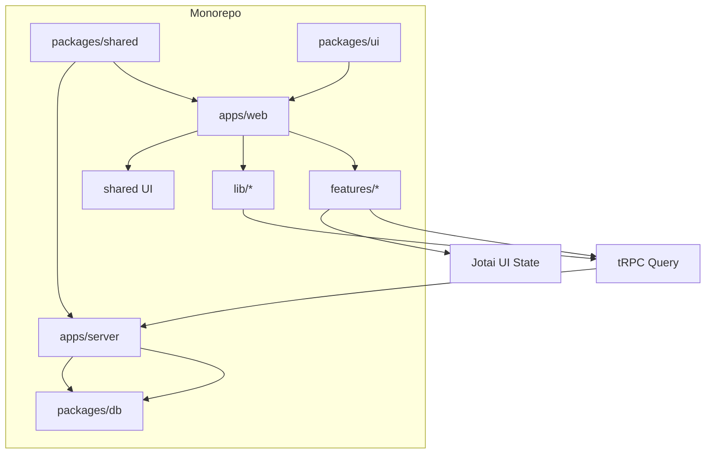
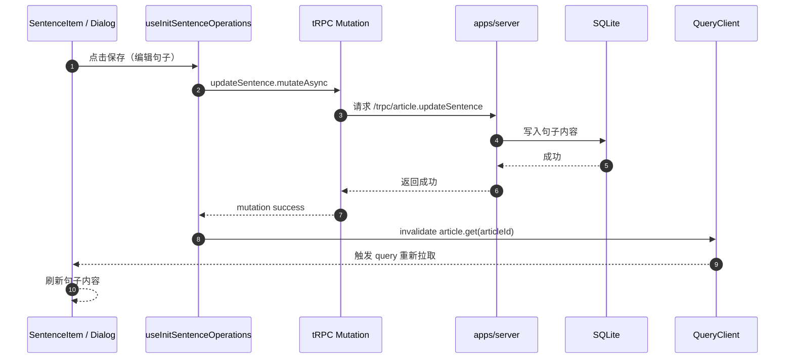

# Sola 架构设计

本文档描述当前 Sola 的整体架构、模块划分与数据流，作为团队统一认知与后续演进的基准。

## 1) 总览

Sola 采用 T3 Stack 变体：TypeScript + tRPC + React + Vite，并运行在 pnpm + Turborepo 的 monorepo 中。

核心目标：
- **单一数据源**：DB 为准，前端以 tRPC Query 为唯一业务数据源。
- **分层清晰**：Server State（tRPC Query）、UI State（Jotai）、全局状态（Jotai）。
- **模块封装**：Feature-based 目录结构，入口统一、内部私有。

### 架构图（Mermaid）



## 2) Monorepo 结构

```
.
├─ apps/
│  ├─ web/                 # 前端
│  └─ server/              # 服务端
├─ packages/
│  ├─ shared/              # 前后端共用类型与schema
│  ├─ ui/                  # 复用 UI 组件
│  ├─ logic/               # 复用业务逻辑（如有）
│  └─ db/                  # 数据访问层
└─ scripts/                # 边界检查/工具脚本
```

## 3) 前端架构（apps/web）

### 3.1 Feature-based 结构

```
src/
  features/
    articles/
      index.ts             # 唯一公开入口（对外）
      components/          # 私有 UI
      hooks/
      atoms/
      layout/
      utils/
    playback/
      index.ts
      components/
      hooks/
      atoms/
      utils/
    ai-management/
      index.ts
      components/
      hooks/
      atoms/
    card-mode/
      index.ts
      components/
      hooks/
      atoms/
    auth/
      index.ts
      pages/
      hooks/
    settings/
      index.ts
      hooks/
      atoms/
  lib/                     # trpc 客户端、query 刷新工具等
```

原则：
- **外部只能通过 `features/*/index.ts` 访问模块能力**
- **模块内部禁止深层跨模块引用**

### 3.2 状态分层

| 类型 | 责任 | 工具 |
|------|------|------|
| Server State | 业务数据源（列表/详情/配置） | tRPC Query |
| UI State | 弹窗、草稿、选中态、播放进度 | Jotai |
| Global State | Auth / Settings | Jotai（全局原子） |

关键原则：**“写 → 刷新”**  
Mutation 成功后只做 `invalidate/refetch`，不在 UI 层手动 patch 数据。

## 4) 数据流与错误处理

### 4.1 数据流
- Query 从 tRPC 获取数据，作为业务数据唯一来源。
- Jotai 只保存 UI 相关状态。

### 4.2 全局错误处理
- tRPC error 在全局 QueryClient 中统一处理。
- UI 层不再重复 toast。

### 4.3 典型业务场景数据流（句子编辑）



## 5) 关键模块职责

### Articles
- 文章列表、详情、句子编辑删除。
- 所有写操作后刷新相关 query。

### Playback
- 播放、循环、影子跟读、卡片模式控制。
- UI 进度状态走 Jotai。

### AI Management
- Provider / Instruction 管理、AI 翻译。
- 所有写操作后刷新指令与详情。

### Settings
- 用户设置、TTS 语音配置。
- 修改后刷新 settings / tts options。

## 6) 边界约束与检查

- Feature 入口统一：**禁止深层导入**。
- Atom 私有：业务模块内部 atom 不对外暴露。
- 统一脚本检查：
  - `check-trpc-jotai-boundary`
  - `check-feature-boundary`
  - `check-atom-privacy`
  - `check-no-refetch`

## 7) 架构演进指南

1. 功能新增优先落在对应 Feature。
2. 所有业务数据以 tRPC Query 为源。
3. UI 状态仅允许写入 Jotai。
4. 入口 `index.ts` 为唯一对外 API。
