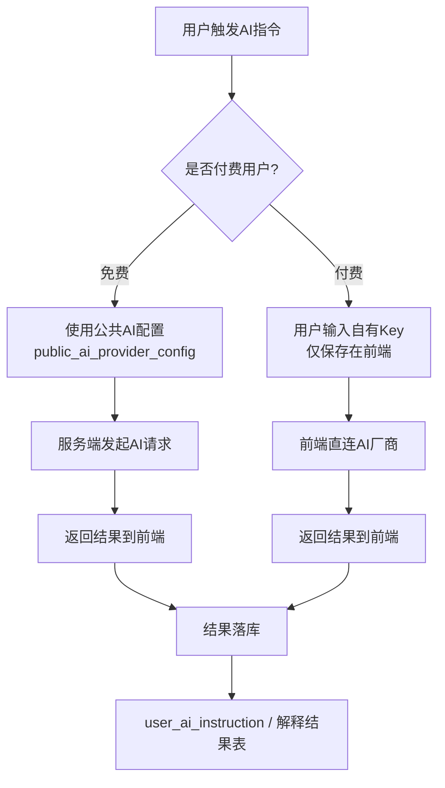

# Sola 改造设计文档

## 目的
- 将现有“整段文本解析”改造为“句子为最小单元”的结构化存储与播放
- 支持单词/短文导入、双语展示、AI 批量解释、TTS 复用与多种学习模式
- 兼容后续多来源扩展（字幕/网页等）

## 改造范围
- 内容导入与切分
- 句子与文章的数据结构
- AI 解释与语音生成流程
- 播放与学习模式配置
- 商业化与额度策略（需求层已有，设计层提供实现落点）

## 核心概念与定义
- 文章（Article）：一段学习内容，来源类型可扩展
- 句子（Sentence）：最小语块单位，单词/短语视为句子
- 母语解释（Native Explanation）：句子的翻译或解释文本
- 语音资源（TTS Asset）：外语或母语的语音文件

## 功能流程设计
### 1) 内容导入
- 单词/短语：按换行切分为句子
- 外语文章：按句子切分为句子列表，保留段落信息
- 结果：生成文章 + 句子列表 + 排序号

### 2) 母语解释生成
- 单句生成：用户对某句触发 AI 解释
- 全文生成：对整篇文章批量生成母语解释
- 完成后以“母语 + 外语”对齐展示，可切换顺序

### 3) 语音生成与复用
- 播放前检查是否已有语音资源
- 若不存在则生成并记录语音资源
- 语速、音色作为语音复用的区分维度

### 4) 学习模式
- 全文循环 / 外语循环 / 单句循环 / 影子跟读
- 可设置母语与外语朗读次数
- 可设置句间停顿时间

## 数据结构设计（逻辑层）
### users（现有 + 新增配置字段）
- id
- email
- password_hash
- native_language
- target_language
- ui_language
- display_order（native_first / target_first）
- playback_pause_ms
- playback_native_repeat
- playback_target_repeat
- use_ai_user_key
- use_tts_user_key
- shadowing_speeds_json
- user_tier（enum: free / vip）
- ai_limit_month
- ai_left
- ai_reset_at
- ai_ad_granted
- ai_vip_bonus
- tts_limit_month
- tts_left
- tts_reset_at
- tts_ad_granted
- tts_vip_bonus
说明：ai_left/tts_left 为当前可用额度，包含基础额度与广告/VIP 赠送；ai_ad_granted/tts_ad_granted 为本月累计发放的广告额度，用于统计与风控。
- study_total_ms
- study_today_ms
- study_today_date

### user_articles
- id
- user_id
- title
- content
- source_type（word_list / article / subtitle / web ）
- native_language
- target_language
- display_order（native_first / target_first）
- created_at
- updated_at

### user_article_sentences
- id
- article_id
- order_index
- paragraph_index
- target_text
- native_text
- created_at
- updated_at

### user_article_sentence_tts
- id
- user_id
- sentence_id
- language_code（如 zh-CN / en-US / fr-FR）
- provider_type
- voice_id
- region
- speed
- cache_key
- url
- created_at
- updated_at
说明：cache_key 由 user_id + sentence_id + language_code + provider_type + voice_id + region + speed 生成，用于快速命中

### public_ai_provider_config
- id
- provider_type
- api_url
- api_key
- models（可用模型列表）
- enabled
- created_at
- updated_at
- 说明：api_url 为厂商 Base URL/Endpoint；api_key 为公共账号密钥

### public_tts_provider_config
- id
- provider_type
- api_url
- api_key
- region
- enabled
- created_at
- updated_at
- 说明：api_url 为厂商 Base URL/Endpoint；api_key 为公共账号密钥

### tts_voice_catalog
- id
- public_tts_provider_config_id
- voice_id
- lang
- gender
- name
- created_at
- updated_at
- 说明：音色库，供公共与个人配置选择

### user_ai_provider
- id
- user_id
- public_ai_provider_config_id
- models_json（可用模型列表）
- is_default
- created_at
- updated_at
- 说明：用户可配置多个 AI 服务商；自带 key 不落库，仅在客户端保存

### public_ai_instruction
- id
- name（指令名称，如“翻译/解释/改写”）
- instruction_type（translate / explain / rewrite / custom）
- system_prompt（系统提示词）
- user_prompt_template（用户提示词模板）
- input_schema_json（输入参数定义）
- output_schema_json（输出结构定义）
- enabled
- is_default
- created_at
- updated_at
- 说明：平台内置的 AI 指令模板；模板中支持变量占位（如 {{target_text}} / {{native_language}}）。

### user_ai_instruction
- id
- user_id
- public_ai_instruction_id（可为空，表示完全自定义）
- name
- system_prompt
- user_prompt_template
- input_schema_json
- output_schema_json
- enabled
- is_default
- created_at
- updated_at
- 说明：用户可复制公共指令并修改；当同类型指令存在用户版本时优先使用用户版本。

### user_tts_provider
- id
- user_id
- public_tts_provider_config_id
- tts_voice_native
- tts_voice_target
- is_default
- created_at
- updated_at
- 说明：用户可配置多个 TTS 服务商；自带 key 不落库，仅在客户端保存

## 关键设计决策
- 句子唯一性：句子全局 id + 文章内排序号，保证可复用与可排序
- 段落保留：文章类保留 paragraph_index 以支持段落展示
- 语音复用维度：语速 + 音色 + 语言 + 句子

## AI 指令设计（新增）
### 设计目标
- 将“厂商/模型选择”和“业务指令模板”解耦
- 平台提供默认指令，用户可覆盖/新增
- 指令支持结构化输入与输出，便于前后端联动

### 业务调用路径（免费/付费）

### 指令选择规则
- 使用用户 AI 默认厂商（user_ai_provider.is_default）
- 指令优先级：用户指令 > 公共指令
- 同一 instruction_type 允许多条指令；is_default 作为推荐默认

### 模板变量
- {{target_text}}：外语原文
- {{native_language}}：母语语言代码
- {{target_language}}：外语语言代码
- {{context}}：上下文（可选）
- {{custom}}：扩展参数

### 典型指令示例
- 翻译：将外语句子翻译为母语
- 解释：给出简洁释义/语法说明
- 纠错：检测外语语法并给出改写

### 输出约束
- 若 output_schema_json 存在，AI 输出需按 JSON 结构返回
- 前端按 schema 渲染（如多段解释、词汇列表等）

## 扩展性设计
- 新来源只需新增解析器（字幕/网页等）
- AI 厂商与 TTS 提供统一接口，便于切换

## 商业化落点
- 免费额度：每日配额 + 广告追加
- VIP：自带 key + 月度额度包
- 防薅：限频、限额、分离 AI/TTS 额度
- 公共账号策略：先采用单一公共账号 + 用户额度隔离

## 风险与应对
- 前端存储 AI key：存在泄露风险，需要后续迁移到服务端代理
- AI 成本波动：需明确额度与复用策略
- 句子切分不准确：需允许用户手动调整或二次拆分

## 交付清单
- 需求对应功能列表
- 逻辑数据模型
- 用户流程与播放规则
- 商业化策略与风控要点

## 行动计划（循序渐进）
1) 数据结构打底：调整 users/user_articles 字段设计，确认新增表结构与字段命名
2) 内容落库拆分：实现按句子切分写入 user_article_sentences，并保留段落索引
3) AI 解释流程：接入 AI 配置与用户选择，支持单句/全文生成母语解释
4) TTS 缓存命中：按 cache_key 查找 user_article_sentence_tts，未命中才生成与落库
5) 播放与学习模式：实现变速、循环、影子跟读，并读取用户偏好
6) 商业化与额度：接入月度额度与广告/ VIP 赠送逻辑，完善限频与统计
7) 迁移与兼容：处理旧数据（整段文本）到新结构的迁移策略
