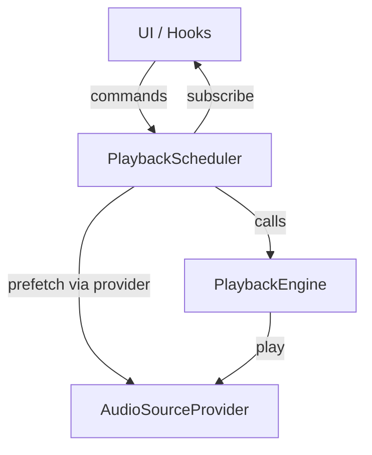

# 领域模型改造计划 v2

基于 `docs/领域模型优化v2.md` 的评审意见，本计划目标是将**播放编排逻辑**从 React Hook 中彻底下沉到 logic 层，形成可测试、可复用、可维护的“播放调度器（Scheduler）”，让 UI 只扮演“遥控器”角色。

## 结论与共识

- 评审意见**合理且有价值**：现状存在“上帝 Hook”与控制流耦合问题。
- 本计划将**保留现有 Entity / PlaybackEngine 的成果**，并在其之上引入 **PlaybackScheduler** 与 **策略模式**，实现真正的“领域控制流下沉”。

---

## 总体目标

1. 领域层拥有完整播放流程控制（循环、影子、单句、随机）。
2. UI / Hook 仅负责调用调度器、订阅状态，不再包含 `while` / `for` 循环。
3. 预加载（prefetch）归属于调度器或 Provider 层，不再由 UI 主动调度。
4. 最终移除 `loopTokenRef` 等控制流 hack。

---

## 阶段划分

### 阶段 0：设计与对齐（1-2 天）

**目标**：确定 Scheduler 的职责边界与依赖注入接口。

**动作**
- [x] 定义 `PlaybackScheduler` 的状态模型与事件接口（status / currentSentenceId / mode / role）。
- [x] 设计 `NextIndexStrategy` 接口与内置策略集合（LoopAll / LoopTarget / Single / Random）。
- [x] 明确与 `PlaybackEngine` / `AudioProvider` 的交互方式（输入/输出）。

**验收**
- Scheduler API 设计定稿，文档可读、可实现。

---

### 阶段 1：实现 Scheduler 核心（逻辑层）

**目标**：构建 `PlaybackScheduler`，把播放控制流从 Hook 迁入 logic。

**动作**
- [x] 新增 `packages/logic/src/playback/scheduler.ts`
  - 依赖注入：`PlaybackEngine`
  - 内部状态：queue、currentIndex、status、mode
  - 统一 `start/stop/pause/resume/loadPlaylist` API
- [x] 实现 `NextIndexStrategy` 并默认内置策略
- [x] 抽离 prefetch 逻辑进入 Scheduler

**验收**
- Scheduler 可在纯逻辑环境运行（无 React 依赖）
- 单元测试可模拟播放流程（可选）

---

### 阶段 2：UI Hook 去控制流（重构 useArticleToolbarLogic）

**目标**：Hook 成为“遥控器”，不再包含循环控制逻辑。

**动作**
- [x] `useArticleToolbarLogic` 仅保留：
  - 调度器实例初始化
  - `start/stop/toggle` 等指令映射
  - 订阅调度器状态 → UI state
- [x] 删除 `startLoopAll/startLoopTarget/startLoopSingle` 中的 while/for
- [x] 移除 `loopTokenRef` / `shadowingLoopRef` 依赖
- [x] 影子跟读“单次播放”由 Scheduler 执行（UI 不再直调播放控制）
- [x] 统一“单次播放”入口为 Scheduler（单句/外语/影子）
- [x] Scheduler 订阅入口收敛为单点（UI 或 atom 二选一）

**验收**
- `useArticleToolbarLogic` 体积显著下降
- Hook 不再持有控制流
- UI 状态更新只来自 Scheduler 订阅

---

### 阶段 3：状态同步与订阅模型

**目标**：统一播放状态来源，避免多个状态源冲突。

**动作**
- [x] Scheduler 内暴露 `subscribe` 机制或轻量事件总线
- [x] UI 端使用 hook 订阅当前播放状态（currentSentenceId / status / role）
- [x] 把播放状态写入现有 Jotai（或内部状态）以兼容 UI

**验收**
- UI 状态与播放进度一致
- 不再依赖 refs 传递状态

---

### 阶段 4：收尾与清理

**目标**：清除遗留控制流/副作用残留。

**动作**
- [x] 删除老式 prefetch 调度逻辑
- [x] 删除 `loopTokenRef` / `shadowingLoopRef` / `userSelectedRef`（若已不需要）
- [x] 更新文档与架构图

**验收**
- 播放模块无控制流重复
- 逻辑层、UI 层边界清晰

---

## 架构图（v2 简化）



---

## 风险与约束

- **竞态风险**：Scheduler 必须保证 stop/pause 时能打断当前播放循环。
- **状态同步**：UI 状态更新必须单向依赖 Scheduler，避免双向写入。
- **依赖管理**：Scheduler 只能依赖 logic/shared，不可反向引用 web。

---

## 交付物清单

- `packages/logic/src/playback/scheduler.ts`
- `packages/logic/src/playback/strategies.ts`
- `useArticleToolbarLogic` 精简版本
- 更新后的文档与图示

---

## 里程碑验收清单（v2）

- [ ] Scheduler 具备完整播放控制能力
- [x] UI Hook 不包含控制流循环
- [x] 预加载逻辑归属 Scheduler
- [ ] 播放状态订阅清晰且稳定
- [ ] 旧逻辑残留已清理

---

## 补充建议（Missing Parts）

### A. 明确“数据提供者”的注入方式
**建议**：Scheduler 不直接依赖 tRPC / fetch，而通过 AudioSourceProvider 注入。

**动作**
- [ ] 定义 `AudioSourceProvider`（例如 `getAudioUrl(sentenceId, role)` / `prefetch(sentenceId, role)`）
- [ ] 在初始化 Scheduler 时注入 Adapter（由 UI 层把 `requestSentenceAudio` 包装为 provider）
- [ ] 单元测试可直接 Mock provider

**理由**
- Scheduler 可在无 React / 无网络环境独立测试
- 依赖方向更清晰，避免逻辑层反向依赖 web

### B. 错误处理的归属
**建议**：Scheduler 内部拥有统一的 `onError` 事件流，UI 只展示错误。

**动作**
- [ ] 新增 `onError` 回调（或 `ErrorPolicy`）到 Scheduler options
- [ ] 由 Scheduler 决定重试/跳过/停止，UI 只订阅错误事件并 toast

**理由**
- 错误策略统一，避免 UI 重复判断
- 播放流程更可控（同一错误不再多点处理）

### 推荐的 Scheduler 接口（参考）

```ts
// packages/logic/src/playback/scheduler.ts
export class PlaybackScheduler {
  state: {
    isPlaying: boolean
    currentSentenceId: string | null
    mode: "loop-all" | "single" | "shadowing"
  }

  start(playlist: Sentence[], startIndex: number, mode: LoopMode) { /* ... */ }
  pause() { /* ... */ }
  resume() { /* ... */ }
  stop() { /* ... */ }

  playSingle(sentence: Sentence, role: Role) {
    this.start([sentence], 0, "play-once")
  }

  subscribe(callback: (state: State) => void): Unsubscribe { /* ... */ }
}
```

---

## 追加阶段：Provider 注入与错误策略

### 阶段 A：AudioSourceProvider 依赖注入

**目标**：Scheduler 只依赖抽象 Provider，避免直接耦合 tRPC / fetch。

**动作**
- [x] 定义 `AudioSourceProvider` 接口（logic 层类型）
- [x] UI 层实现 Adapter（封装 `requestSentenceAudio`）
- [x] Scheduler 初始化注入 provider（并替换内部直接调用）
- [ ] 添加 provider mock，支持单元测试

**验收**
- Scheduler 不再引用 web / trpc
- Provider 可被替换/模拟

### 阶段 B：错误策略内聚

**目标**：播放错误由 Scheduler 决策，UI 只展示。

**动作**
- [x] 新增 `onError` 回调 + `ErrorPolicy`（重试/跳过/停止）
- [x] 在播放失败场景统一走 `onError`
- [x] UI 层只订阅错误事件（toast 展示）

**验收**
- UI 不再写重复 catch/逻辑分支
- 播放错误行为可配置、可测试
